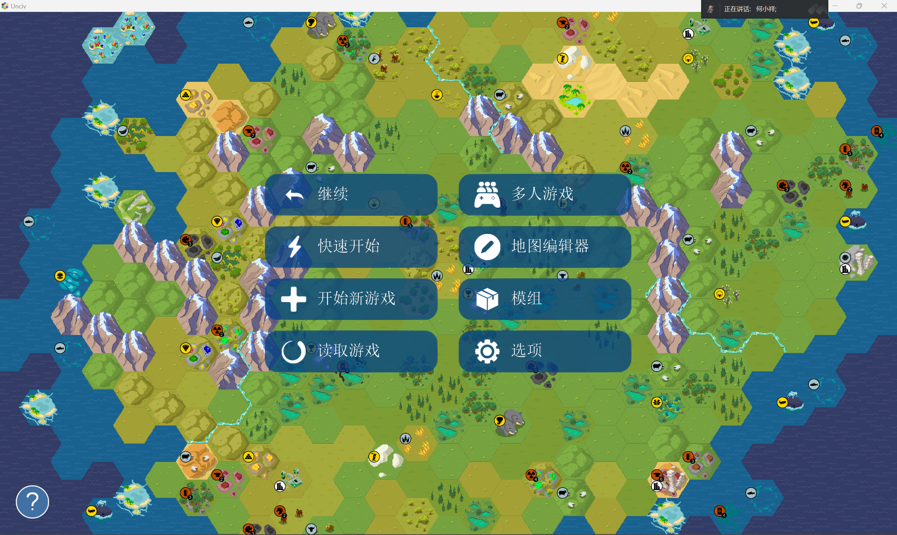
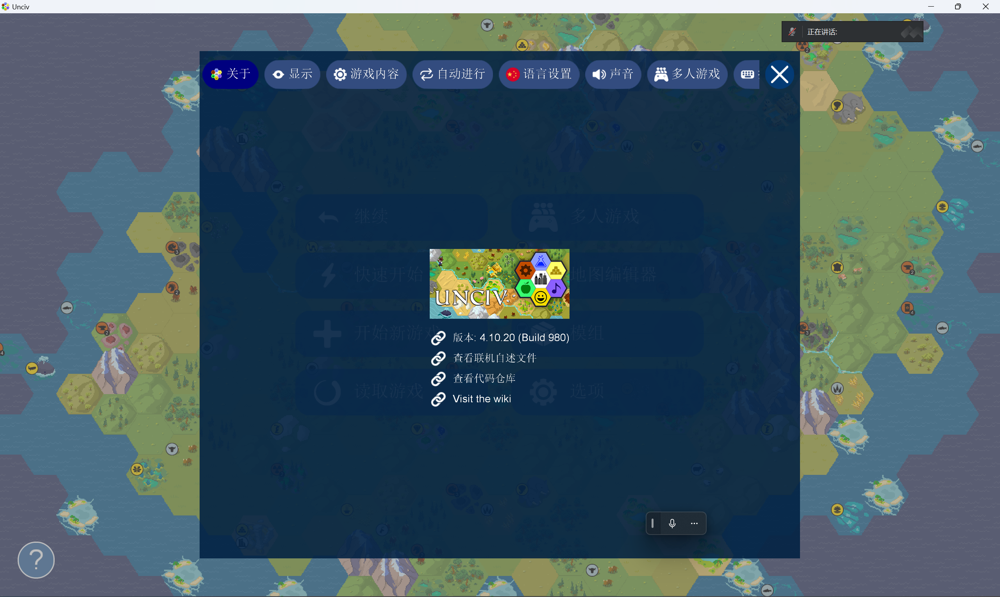
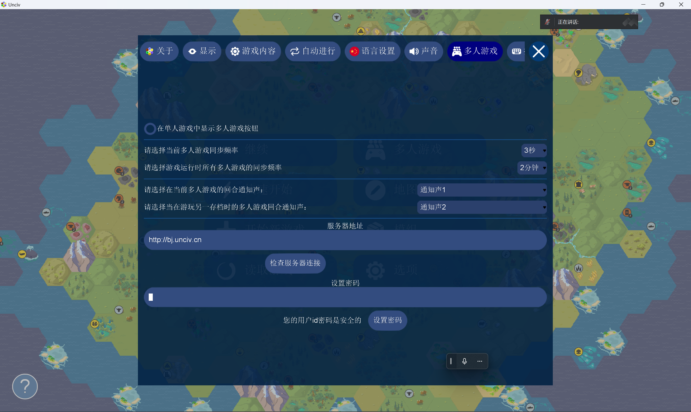
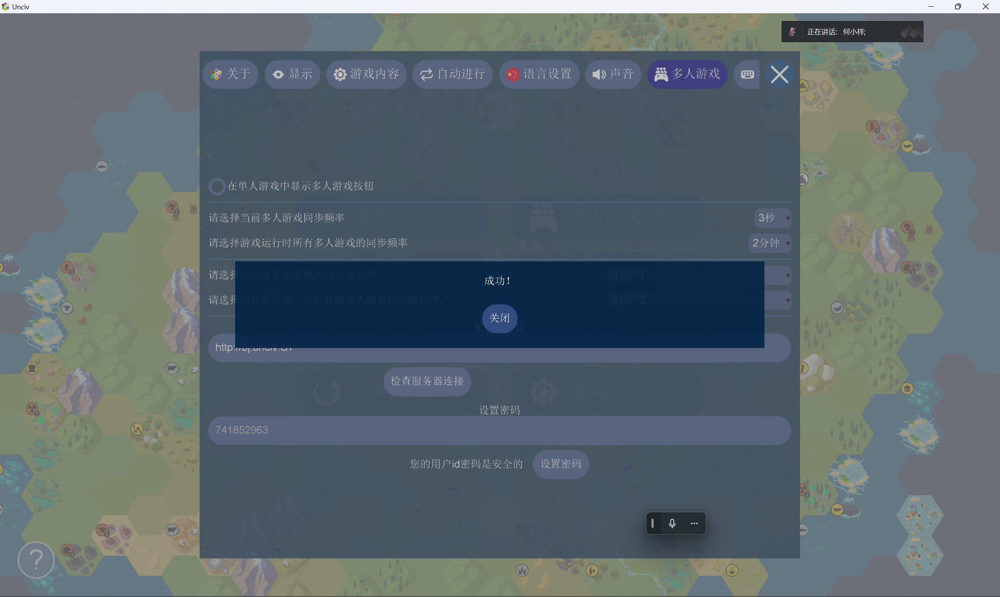
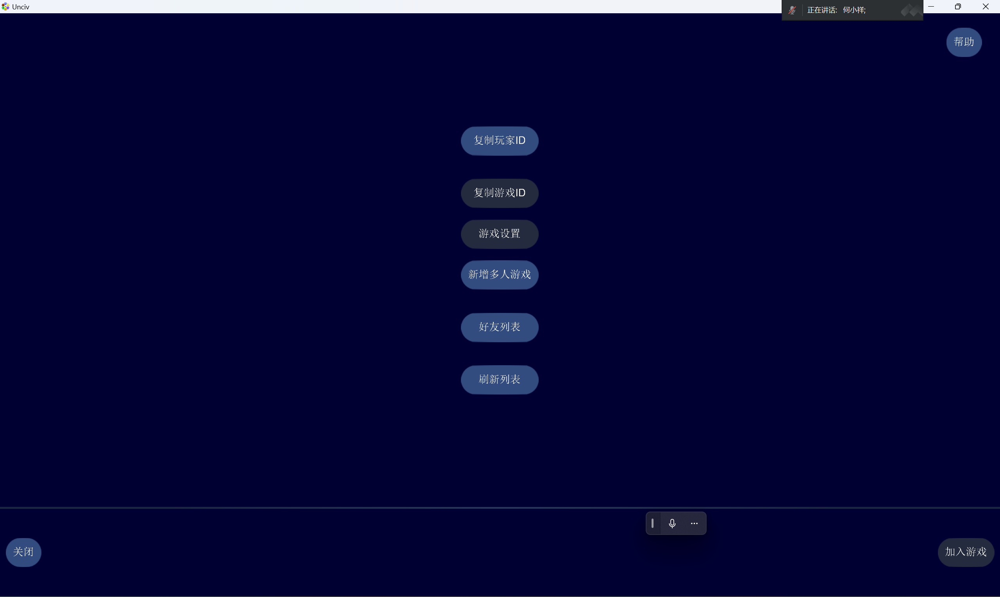
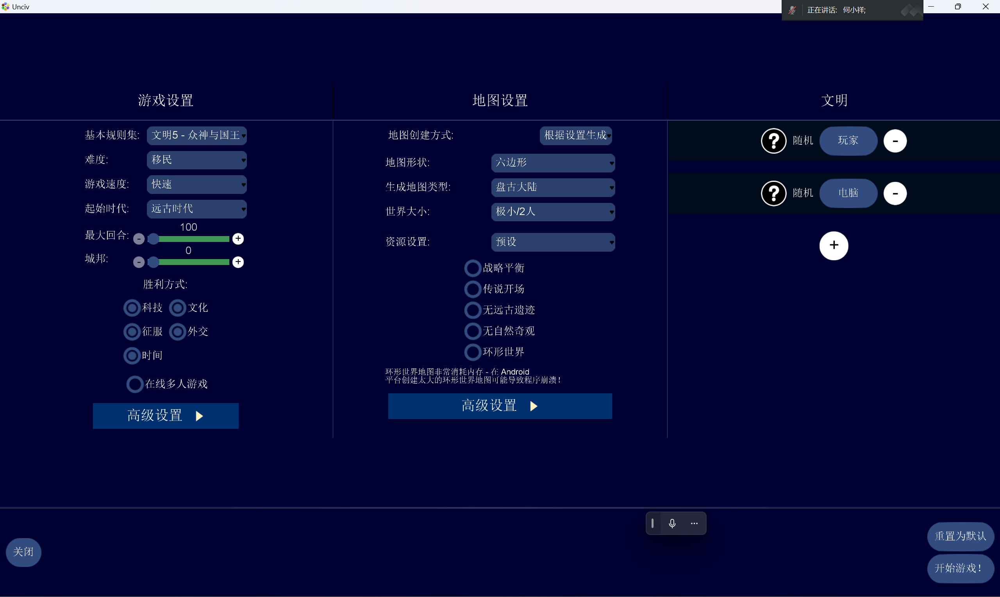
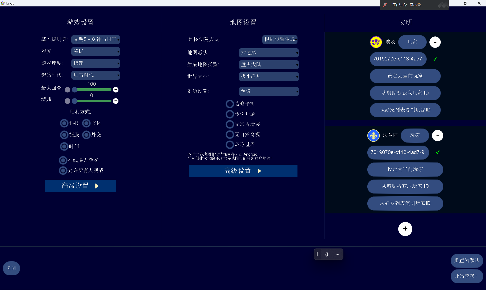
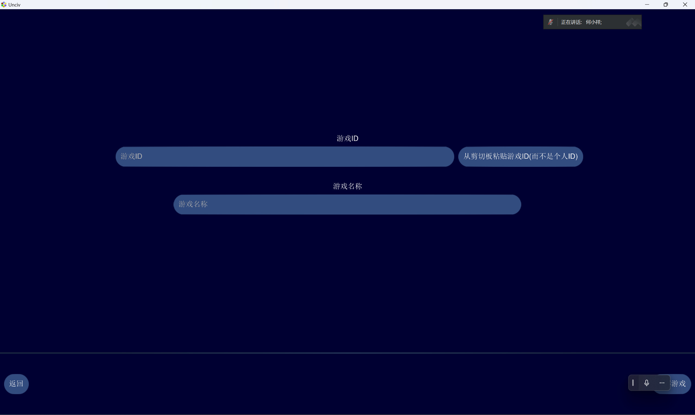

<!-- markdownlint-disable MD025 -->

# Unciv 联机教程

> 作者：SpringPizazz
>
> 完稿日期：2024年3月27日

联机之前，首先要了解 UID：UID 是用户身份证明（User Identification）的缩写，在 Unciv 的联机中，UID 分为玩家 ID 和房间 ID 两种，玩家 ID 用于辨识不同玩家，房间 ID 用于辨识不同对局。

此外，玩家需要允许 Unciv 程序访问剪贴板（尤其是安卓端）以便 Unciv 获取这两类 UID。

此外，所有对局参与者都需要严格保证游戏版本相同，模组相同，模组版本相同以避免未知错误。

## 与联机服务器建立联系

打开主菜单，点击"选项"按钮，

点击上方"多人游戏"按钮，

输入服务器地址，地址为：<http://sp.unciv.cn:30123>

并按上图设置同步频率，

设置密码（默认密码是123456）以防止他人冒用你的玩家 ID 干扰对局，

点击"检查服务器连接"按钮，此时应该弹窗提示"成功！"，

退出 Unciv 并取消后台进程，打开 Unciv，回到原来界面再次点击"检查服务器连接"，若仍提示"成功!"，说明你成功与服务器建立联系！

## 获取玩家 ID

回到主菜单，点击"多人游戏"按钮，

点击"复制玩家 ID"按钮，

现在你的玩家 ID 就存放在剪贴板上了！

如果你是对局发起者，请保留你的玩家 ID；如果你是对局参与者，请把这段玩家 ID 通过社交媒体（如 QQ）发送给对局发起者并声明这是玩家 ID（而不是对局 ID）。

## 房主创建房间

回到主菜单，点击"开始新游戏"按钮，

点击"在线多人游戏"按钮，

将玩家 ID 粘贴到对应的文本框内并选择对应的国家

选择相应的地图配置后，点击右下角"开始游戏！"按钮，进入到游戏主屏幕，此时房间 ID 将自动保存到剪贴板，将这个房间 ID 发送给所有对局参与者并声明这是房间 ID 而不是玩家 ID。

## 参与者加入房间

参与者复制房主发送的房间 ID 到剪贴板，

回到主菜单，点击"多人游戏"按钮，

点击"新增多人游戏"，

在第一个文本框粘贴房间 ID，在第二个文本框输入你对此对局的备注，如不填则被房间 ID 覆盖。

输入完毕后点击右下角"保存游戏"按钮，回到上一页面，再点击多出的显示刚才备注的按钮，点击右下角"开始游戏"，即可参与对局。
