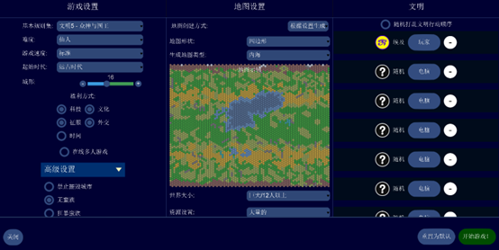
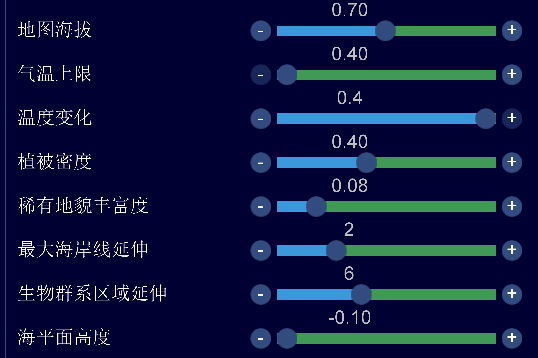

<!-- markdownlint-disable MD025 -->
<!-- markdownlint-disable MD045 -->

# 自主左二前应该做什么？——自主0-40T发育流程简析

> 作者：华花
>
> 版本：4.19.6
>
> 日期：2026/2/22

## 前言

笔者几天前在QQ群中看到一份错误百出的攻略，竟然试图在盘古小/中图和平种田...因此深感Unciv pve入门攻略的缺乏和人才的凋敝，应花醉的邀请写作此篇，希望向初涉pve的萌新们介绍以飞天为目标的pve中，自主左二前的开荒期应该做什么和不应该做什么，同时介绍近年来pve在前期的一些探索和成果。

## -1T: 文明和地图配置

对于Unciv pve而言，当选择一个文明，打开一张地图开始打时，很多时候结局就注定了。或许C5玩家从没有想过，只要稍微改变一点点东西，就能逼迫玩家做出这么多的改变和抉择。在Unciv里地图配置是这么的重要，以至于成为pve的基石，是以下一切策略得以成立的根本条件。

通常来说，本篇所介绍的开局流程适用于几乎所有文明，因为在（标速）40t及以前即对整个流程有重大影响的3U相当少，在同一张图里，或许除了神板鸭、埃塞、巴比伦、法兰西、印度这几个文明之外，所有文明都会做出同样的操作和选择，拥有类似的发育，充其量是节点的速度和城市的发育有所不同。不过，考虑到u的环境太差，需要高文明强度才能带来好的游戏体验，笔者建议萌新们不要选择白板或接近白板的文明，如印度、美利坚、德意志、桑海等一大批没有显著产出优势的普通文明，而选择宗教优势或笑脸优势文明，如玛雅、埃及等一线文明将显著提升您的游戏体验。

本文采用的地图比较特殊，因为使用标图会严重影响pve的游戏体验。

**难度**：一般选择仙人/天神，默认使用标速远古开局（联机pve则是快速），胜利方式除分数外全开。由于蛮族大多数情况下会恶心玩家，故可以不开。核弹间谍随意，因为没有用...

**地图使用**：

- 四边形巨大内海（六边形也可，但不要用扁平六边形；巨大是为了保证铺城空间；选内海是因为河流多，也可千湖，基本越像内海图平均质量越高）
- 开遗迹城邦（等效更多资源），战平/传说随意，资源大量（预设会少一些），开环形（凡是地图左右两侧均为陆地就一定得开）

**高级设置**（以图片为基础）：

- 海拔决定丘陵和山脉比重，印加之类吃地形可调
- 气温和温度的意义是刷出大片沙子，方便沙神发力，不宜改动
- 植被决定树和丛林比重，0.8左右=全树图
- 稀有决定环礁/绿洲等比重，默认的0.05也可
- 海岸线=浅海宽度，1-2为好
- 生物群系决定草原/平原延伸，默认即可
- 海平面决定海域面积，开小有助于减少海奢种类并增大铺城空间

**AI数量和城邦数量**：相对任意。一般来说太多会挤占铺城空间，太少则大片空地浪费。一般在上述设置下开7-10个AI，开1.5倍于AI数的城邦，即12-16个。

所附存档例子来自梦游刷的埃及图，也欢迎大家来pve群（QQ：233275576）交流讨论。

## 0-15T: 公式开局

一般采取以下公式开局：

- 首都尽量坐矿，人口锁高产（最好是3粮）地块，锤2猴接碑
- 科技走制陶-采矿（如果可以遗迹踩出来其中某个自然更好），文化直走自主左线
- 遇到AI迅速借钱，缺少筹码时考虑宣战回收，顺便抢工人
- 钱买小庙，有闲钱且缺乏高产地块可以买地，如还有多可以买工人甚至移民

### 详细说明

对于玩家而言，远古开局时首都可选的建造项目实际上相当有限，无非工人、移民、猴子、棒子、碑五类。首都1人口时不能敲移民，棒子相较猴子不仅贵15锤而且少了移动力加成，多的力前期也没有用，因此均不作考虑。现在pve中多数模仿C5采取两猴接碑的开局公式，下面将解释为什么这么做。

相信对pve有一定了解的玩家都知道猴子的价值，nosl中自不必多说，需要猴子提供信息来做出决策。即使在sl透图环境下，也需要出猴子见AI吃贬值换现金抢工人，见城邦拿见面礼和任务，以及帮助完成寻找奇观、AI城市等任务。如果猴子出的少，见AI城邦慢，获得的收益自然少且晚。考虑到1个猴子在巨大内海下明显不够用，一般以连锤2个为宜，再多则可能卡补给吃到产能惩罚debuff，也会拖慢纪念碑的节奏，进而影响左二时间。

此外，纪念碑作为前期的文化大头，对于加速左二节点也有很大作用，早锤早享受，在锤完猴子后立即接着锤比较好。

需要注意的是，开局敲工人是pve典型的错误操作，原因主要是工人70锤太贵，~1猴+碑的锤子。硬敲出来不仅卡探路和左二的节奏，而且15T左右的时间已经足够开局棒子直奔AI家里抢到工人回家了，敲出来也只能开田/矿，提供的产出不多却抢占了宝贵的探路和左二时间，还抢不到开奢侈的生态位，何况坐矿开也不是特别需要工人...

以上的部分几乎和C5玩家采取的开局一致，下面介绍一些u开局独有的手段。

### 骗宣

对于C5来说，现金交易仅可以在宣友后/和谈时进行，因此如果希望撕毁奢侈/GPT换现金的条约，必须向盟友/大多数情况下可以续约的盟友宣战或和谈后等10T和约到期再宣一次。无论哪种方法都需要花费大量时间，效率相当低下。由于河流金的缺乏，玩家缺少筹码，AI的现金往往也不多。

在u里则无需这么麻烦，依靠河流的GPT或坐矿的GPT和奢侈即可快速抽干1-2家的现金，但在7家AI的情况下玩家很快会面临筹码不足而AI现金有余的情况，这时候就需要向AI债主宣战以回收GPT。这样，就可以将大多数AI的现金收入囊中，也即使用玩家的筹码作为杠杆，可以撬动5-6家AI的资金。

> **另**：骗宣（以及堡垒大法诈骗现金）在C5中普遍被认为是不道德的手段，许多大神均表示自己不会使用。然而，在u不断强化艰苦环境和神必AI的背景下，骗宣被pve玩家们广泛的接受和使用——毕竟没人能指责一个快渴死的人到处找水喝。

### 坐矿

尽管骗宣有效的减小了筹码的峰值压力，但玩家开局即使首都沿河坐矿，GPT也往往只有10左右，仅能换得220g。即使对于穷一些的仙人AI，见到第2家时筹码也面临耗尽的窘境。但玩家在仅有首都或者铺出一分的情况下，GPT并没有很大的增长空间，筹码仍然不足。而u中常用的筹码仅有GPT、奢侈和大使馆/开边，我们开局没有外交筹码，只能寻求开发奢侈。

这又引出一个问题，如果是非矿系奢侈如历法/捕猎，那么我们至少等到30T才能开发，相比矿奢亏了10T的现金，即使是矿系，也需要抢工人回来开发，7T后才能奢侈拿到手，这段时间里AI会花掉自己的现金买建筑/买地，这些钱也等于是倒海里了。那么，什么方法可以以最快速度获取奢侈呢？答案自然是把首都坐在矿奢上，采矿一到就立刻能获得奢侈，然后将其作为筹码换取现金，快速开始滚雪球进程。古人有云：坐矿开=近点黄金国！

### 买庙

由于pve种田必须发教，而除埃塞、凯尔特之外，早期能稳定获取鸽子的方法仅有小庙（如果高强度刷图有机会近点3宗邦靠见面+4鸽子发，但太过稀有）。如果前期两猴接碑~16T之后自锤小庙，大概会在20+T锤出，30+T攒够10鸽子首发神系。但是，30+T的首发神系是极度危险的，宗教白板AI发出神系的时间点也大概是30+T，如果主场沙神被AI抢发，这局将直接崩盘；即使AI给机会发了其他神系，神系也将因为次发需要15鸽晚5T出来，这段时间很可能又有AI插队，时间点就会进一步拖后，风险极大。同时，主场沙神图发出神系即有5鸽/T的输出，希望尽快发出神系增加鸽子产出加速发教。

那么，既然自锤风险大收益低，那可以想到利用早期得到的金币直接买。小庙40锤200G，自产金币加上换得金币是足够买的。其5.00的锤金比相比竞争项目工人70锤310G，4.43的锤金比也差距较小。只要场上没有埃塞、凯尔特这俩cs AI，买庙几乎必定首发。这样，理论上10T解锁制陶时可以直接买庙，20T即发出神系，相比自锤能多吃10+T神系鸽子，效果卓群。

## 15-40T: 首都发育和全局资源

不考虑遗迹和城邦，碑开将在45T左右走出自主左二，而实际由于文邦和文化遗迹，玩家往往在40T即可走到，随后便反复移民——项目——移民...直至城市足够。因此在15-40T这段时间，玩家的主要任务是发展首都和获取全局性资源，为左二锤移民及后续发展打下基础。即在首都继续涨到5-6人口并改良工作地块（尤其是丘陵），撑高基础锤方便未来吃溢出的同时，玩家将利用多余的产能锤兵/补建筑/拼奇观，以补充首都发育或获取一些仅在这个时期可以获得的全局资源。下面将简述这些策略。

### 锤兵策略

锤兵策略对首都发育显然没有帮助，只能想办法用兵力获取全局资源。又因为u的环境下和约几乎无用，且因为AI铺城和兵力的爆炸增长，兵力贬值极快，故锤大量兵为了收益最大必然导向灭国。在AI距离近、地形平、有河流、资源多，及玩家有优质早期uu如巴弓、驴车、驴骑等时可以考虑灭国开，在灭国开前需要不断出兵压制，待马车/小弓到位再攻城。不过，近来发现灭国开还有更为有效的方式，将在下面详述。

近来发现在AI1分/2分移民未坐下时将其劫走，可以让AI反复进入锤移民的节奏而不再出兵，也就是说AI将成为玩家的工人机器，只要开局出的一点兵就可以慢慢获得10个左右的工人，堪比开门3个黄金国。同时，由于城市数量少，首都一直在出移民且兵力不断被消耗，AI的兵力和城市将永远不能成型，玩家可以在70T左右用与灭国开相似数量的部队方便的收割AI首都。考虑到产能的大量贬值和该流程获得的巨量工人，即使不能拿下AI首都也是收益巨大的。这个方法由于需要在15T左右在近点AI的首都——分城点连线蹲守，用1棒1猴/1枪的兵力平地截杀移民，因此在sl透图下有一定的稳定性，nosl下则几乎没有可能实现。本文最后所附的例子中便运用了这一方法。

### 补建筑策略

补建筑策略主要关注首都的发育，几乎不提供全局资源。在碑+小庙完成后，远古提供全局产出的建筑仅有图书馆，收益太低，科技也偏，通常不作考虑。而基础产出建筑如粮仓往往更受欢迎，因为首都附近往往有许多麦/鹿/香蕉等奖励资源，造完粮仓可以迅速从3人口涨到5-6人口满足左二需要。水车由于科技靠后难以考虑，石工也类似的受制于科技和开发进度。因此补建筑往往遇到产能有余而科技太慢无东西可锤的困境，这时通常会补一些兵力用于自卫或者自锤工人补改良。

### 拼奇观策略

拼奇观策略与锤兵类似，主要提供全局资源。早期可锤的奇观有大灯塔、巨石、大图、粮庙、大金、宙斯、陵墓这几个，其中仅有粮庙、大金、大图在这么早的时间有争夺价值。大金由于AI建造倾向低，可以在左二后利用相对廉价的溢出锤补，而且这么早的节点拿到工人也没有太多地块要改良，甚至因单位过多会吃产能惩罚，所以一般不会提前锤。而大图这么早拿到只能秒哲学，送的瓶子可以加速水渠文官，但总感觉不如基础产出...粮庙通常是比较稳妥的选择，尽管天神AI对其同样热情，但+10%粮收益仍然很大，值得去拼一下。需要注意的是，sl锤奇观由于可以偷看存档没有丢的风险，nosl就建议自求多福了，u这方面信息太少，奇观赌的成分很大。

### 资金管理

另外，由于玩家不断从AI手中借钱和抢工人，很快单城就会面临钱花不出去（买建筑实在有点亏，买城邦又没有任务打底）同时还吃产能惩罚的困境，因此可以攒一波500G买移民规避产能惩罚，并利用提供的鸽子加速发教（左二送的2分也是同理，新切术需要快速发教生产白城以节省传教鸽子）。

### 城邦管理

对于城邦，由于30T开始发任务（4.19.6仍可以sl，4.19.12更新后不再能sl改，但可以改存档中玩家的civid来改变过T发的任务），之前没有任务直接砸=亏钱。如果愿意sl，发的任务最好是10T之内能做的（如开近点奢侈/AI主奢、见自然奇观、快建好的奇观、见AI城市等），如果是神秘海产/远端自然奇观/大商大艺（前期除了大军可能有其他全没有）之流，可以直接左上角sl。这样见面10T后任务+250就可以同盟了，收益翻倍。对于没有收益的军邦就不用费心刷任务了，直接找机会宣战给全部同盟城邦+10影响力即可（所以说凡城邦都有价值，只不过军邦提供的不是兵，而是影响力，或许还有勒索得到的金币？）。

### 宗教发展

宗教方面，标准的沙神图大概就在40T左右发教，一般就是速强化选葬仪+佛塔/大小庙脸+典籍，顺序不太重要，因为AI对这些信条（除了典籍&大庙脸）都不太热情...注意玛雅不要选大庙脸卡自己即可。

## 附录

最后附笔者打的0-50T的一套存档（sl），希望读到这里的玩家尝试一下自己能否按照本文的策略，取得更好的发育！

埃及开局存档.zip

链接: [https://pan.baidu.com/s/1zL2GeWAPIkvDxv51E5FTmw?pwd=9iha]
提取码: 9iha

也欢迎大家来pve群（QQ：233275576）交流讨论。
