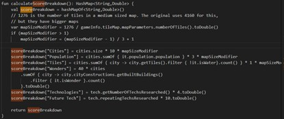

<!-- markdownlint-disable MD025 -->
<!-- markdownlint-disable MD045 -->

# 文明积分计算

> 作者：华花
>
> 版本：4.19.12
>
> 日期：2026/2/14

## 前言

文明积分作为报表的第一元素，通常很受萌新们的重视，而有经验的玩家都认同它实际上毫无意义。

## 一：按地图大小计算分数折算比

以中图1276格为标准（C5标图则以80*52=4160格），t=1276/开的图总地块数；如果t>1，t=1+(t-1)/3。

## 二：分别计算各类分数

- 城市分 = 城市总数 × 10 × t
- 人口分 = 人口总数 × 3 × t
- 地块分 = 圈到的非水域地块数（水域指浅海/海洋，不包括湖泊）× 1 × t
- 奇观分 = 拥有世界奇观总数 × 20
- 科技分 = 已研究科技数 × 4
- 未来科技分 = 已研究未来科技次数 × 10

## 三：加和所有分数，得到文明积分

将上述各项分数相加，即得到最终的文明积分。

## 四：举例计算

我们来举一个实例看看公式是否正确：


这张图是大图（66×43=2838，t=0.4496），我们是荷兰，9城65人口；地块有2片海，领土是102；建了3奇观；研究了20个科技。那么分数是：

```txt
0.4496 × (90 + 195 + 102) + 120 + 80 = 373.99
```

恰好对应374分。

## 五：小贴士

- 更小的地图在相同发育下具有更高的分数，更大的地图则相反。
- 由于常规对局中不会多次研究未来科技，因此文明积分可以由报表中的数据及政治栏目中的奇观数量近似计算，这也意味着文明积分不具有战术上的意义。
- 常规对局中文明积分通常随着城市、人口和自然扩地、研发科技数缓慢上涨，突然的跃升可能是由于建立/攻占/联姻城市，建成多个奇观或尾盘烧大科过大量科技。
- 文明积分能够一定程度上反映文明长期实力，相比报表中其他数据（如产能、金钱等）很难在短期内剧烈变动。但对局中更多关注短期数据（如军评、重要文化节点）以判断局势和做出决策。

## 六：代码参考

`core\src\com\unciv\logic\civilization\Civlization`

（注：现版本中代码已将具体分数折算比例交由规则集定义，需结合G&K代码阅读具体数值）


