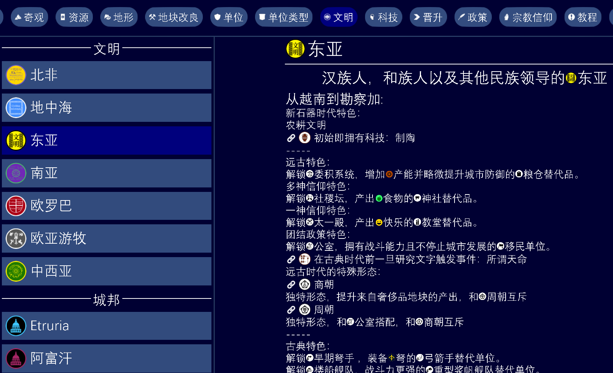
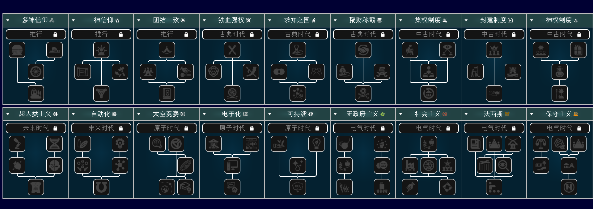
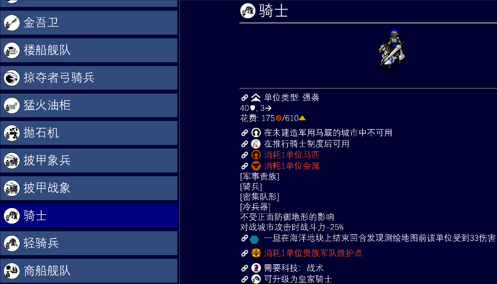
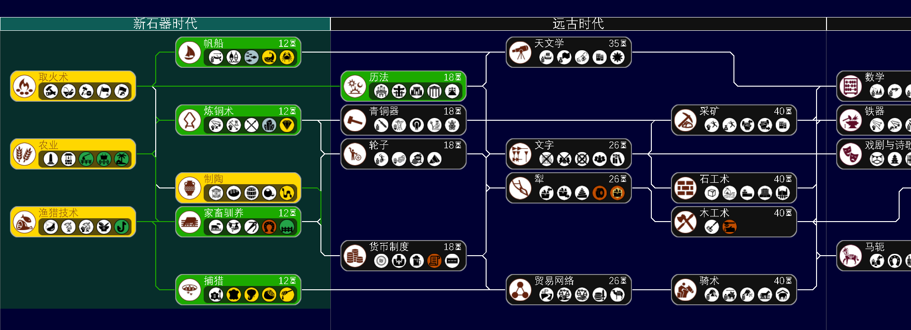
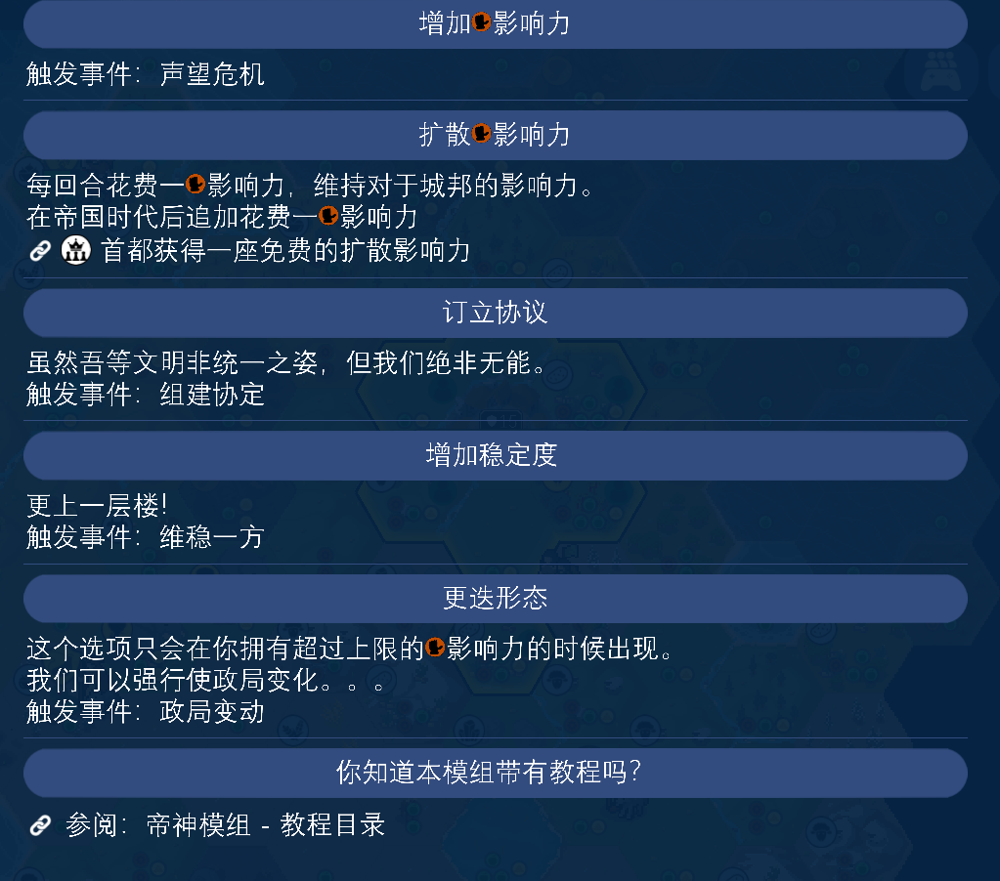
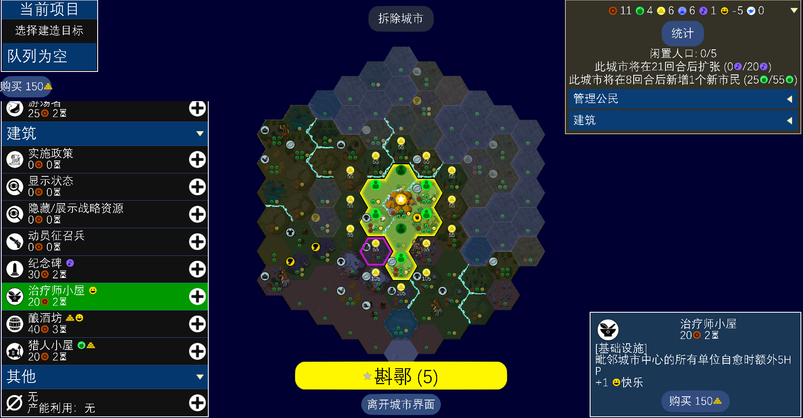

## 关于 EnD

Emperors and Deities（帝王和神明）既没有帝王，也没有神明，而是一个颠覆Unciv/文明5玩法的大规模重置规则集mod。
包含有：

* **多样的局内路线抉择**：政策，宗教，历史政体，事件。可以说是借鉴了文明7和人类的部分机制，但是使用个人理解重新架构。开局选择区域，之后这片多姿多彩的土地上的所有民族和文明都归你指挥。（中世纪以后内容施工中）

  

  
* **单位和建筑机制全盘细化**：单位和建筑不单单数量大幅度提升，甚至还有细化分类和Tag支持，和局内路线息息相关。是选择把军权交给与国同休的军事贵族还是贯彻职业化军队的改革？

  
* **科技树全盘细化**：从新石器时代的起始科技到帝国时代的线列步兵，从工业时代的电报到信息时代的数据中心。EnD的科技树包含了很多原版没有概括的领域，包括造纸术，水泥，定装弹等。~~而且基本上每个科技都个大汁水多~~。(目前电气-未来时代暂时还在施工。)

  
* **快乐机制重置**：支撑黄金时代的帝国龙骨不再是区区奢侈品资源，而是它们带来的暴利。奢侈品资源不再直接提供快乐，而崭新的市政建筑树，医疗建筑树，和其他基础设施将会决定城市治理的难度。完全同化城市现在也需要大量准备。
* 全新稳定度机制：不快乐会爆负面事件影响你的稳定度，之后叛军减成两开花。只有把你积攒的影响力花掉，你才能逆转乾坤。当然，建立健全的市政才是治本之举。

  
* 更多小巧思：把一个城市产出的多余人口/资源放到另外一个城市？完全可以！让商朝打败周朝，让哈拉帕人击败雅利安人？取决于你的意志。即使白板文明，也可以通过局内成长享受大部分游戏内容。

  

### 核心理念

> "能改的全部动了。" - CX61

本模组忠实于历史准确度。但是这个定义并不是完全准守历史做无止境细化，而是筛选适合文明这个六边形棋盘的要素，进行阐释和精炼。争取让玩家体验到《文明》系列玩法的船新一面。

### 快速链接

::: tip 模组资源

- [GitHub 仓库](https://github.com/chenxing61/Emperors-and-Deities)

:::

### 加入社区（特急）

如果您对模组有任何建议或问题，欢迎加入我们的 QQ 群：

或者Discord群组：

### 总之请试玩该模组！因为没人玩既调不了平衡，也做不了QoL！！！

### 安装指南

1. 下载最新版模组文件
2. 将模组文件夹放入游戏 `mods/` 目录
3. 在游戏设置中启用 Emperors and Deities
4. 开始新游戏即可体验
5. 或者，如果你有github通行方式，可以直接在游戏内下载。

::: warning 注意

- 模组仅支持新游戏，无法兼容已有存档
- 建议在标准速度下游玩以获得最佳体验

:::

### 致谢

感谢所有为模组做出贡献的玩家和开发者！

特别感谢：

- Unciv 开发团队提供的优秀游戏平台（Yarim和其他牢开发者们）
- 所有已经参与测试和反馈的玩家
- Unciv 社区的支持（模组大佬们）
- 提供翻译的社区成员
- Bucketeer提供的美术支援
- 还有看到这里的你！
